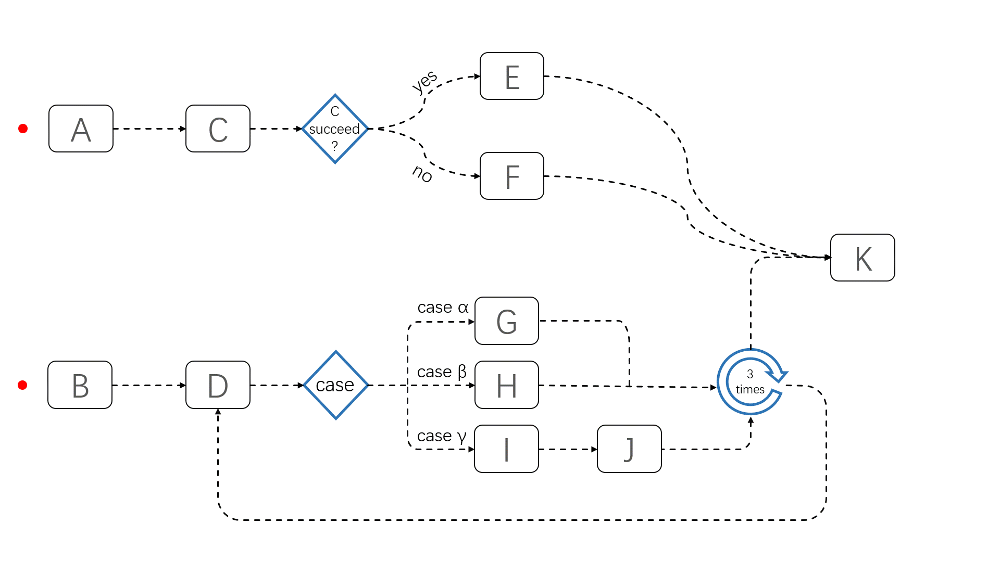

# JobFlow



## Project Status

This project is being donated to the volcano community

## Introduction

Volcano is an CNCF sandbox project aiming for running tranditional batch jobs on Kubernetes. It abstracts those batch jobs into an CRD called VCJob and has an excellet scheduler to imporve resource utilization. However, to solve an real-world issue, we need many VCJobs to cooperate each other and orchestrate them mannualy or by another Job Orchestruating Platrom to get the job done finally.We present an new way of orchestruing VCJobs called JobFlow. We proposed two concepts to running multiple batch jobs automatically named JobTemplate and JobFlow so end users can easily declare their jobs and run them using complex controlling primitives, for example, sequential or parallel executing, if-then-else statement, switch-case statement, loop executing and so on.

JobFlow helps migrating AI, BigData, HPC workloads to the cloudnative world. Though there are already some workload flow engines, they are not designed for batch job workloads. Those jobs typically have a complex running dependencies and take long time to run, for example days or weeks. JobFlow helps the end users to declaire their jobs as an jobTemplate and then reuse them accordingly. Also, JobFlow orchestruating those jobs using complex controlling primitives and lanch those jobs automatically. This can significantly reduce the time consumption of an complex job and improve resource utilization. Finally, JobFlow is not an generally purposed workflow engine, it knows the details of VCJobs. End user can have a better understanding of their jobs, for example, job's running state, beginning and ending timestamps, the next jobs to run, pod-failure-ratio and so on.

## Demo video

https://www.bilibili.com/video/BV1c44y1Y7FX

## Deploy
```
kubectl apply -f https://raw.githubusercontent.com/BoCloud/JobFlow/main/deploy/jobflow.yaml
```
